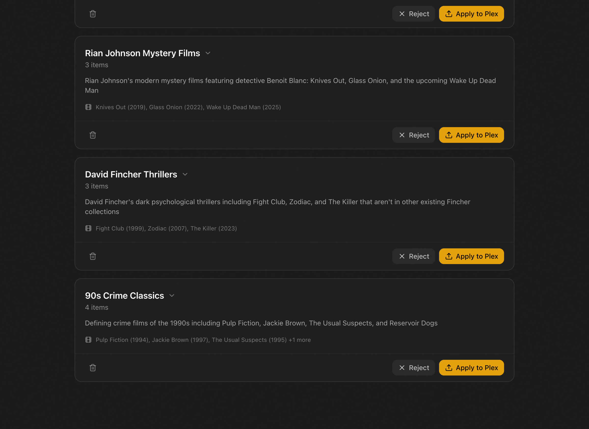
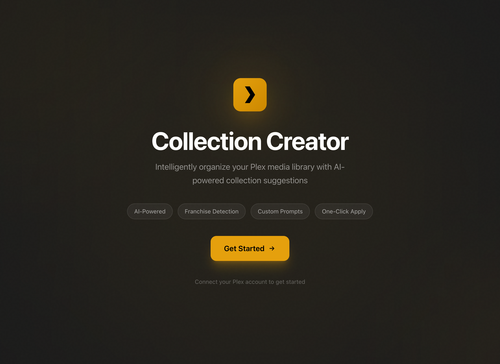
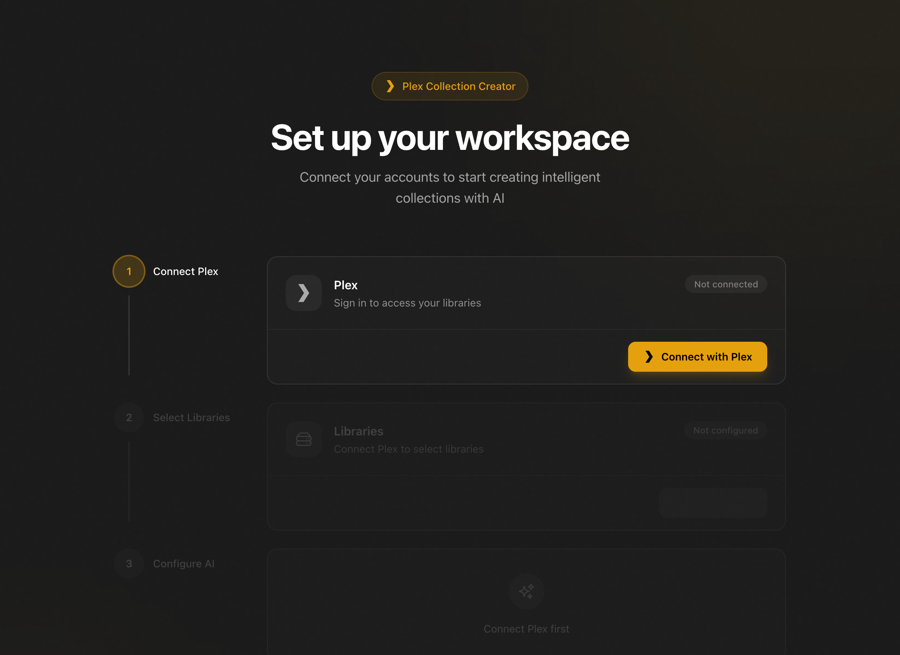
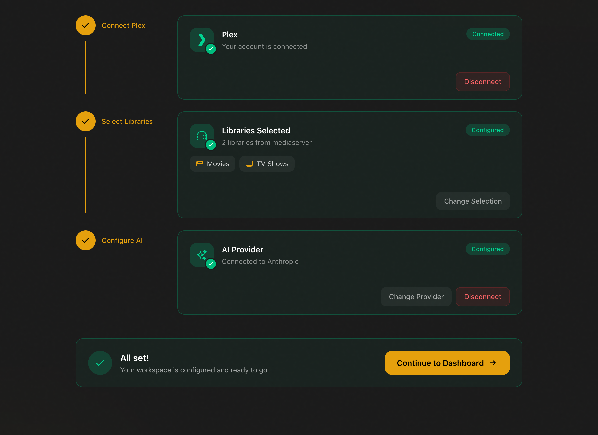
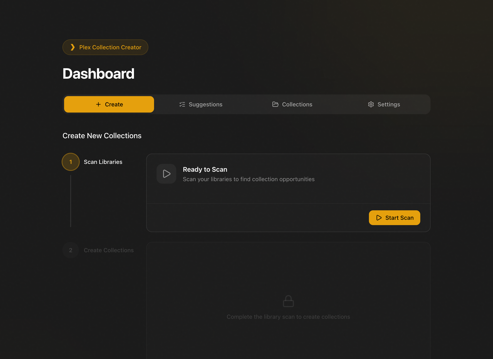
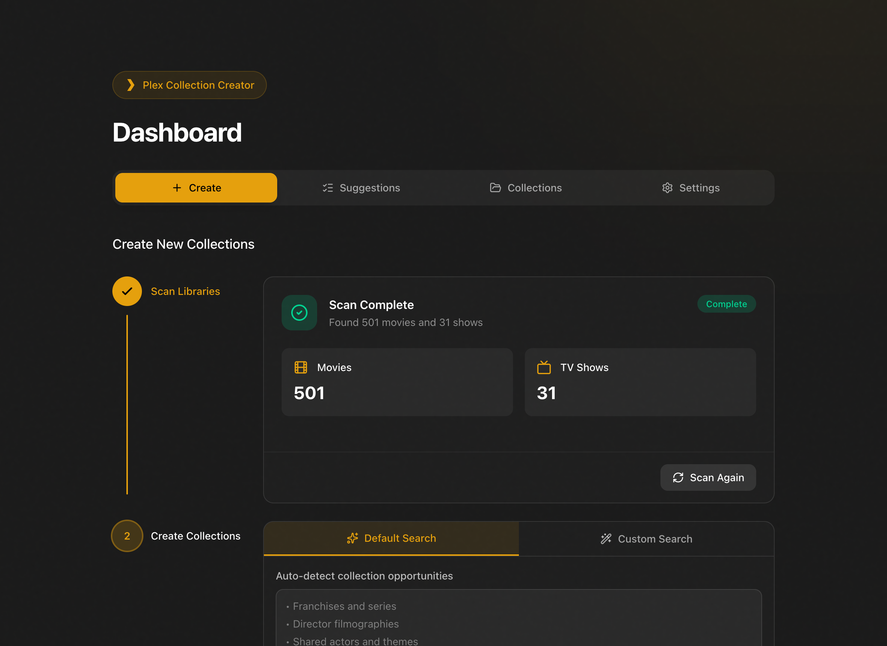
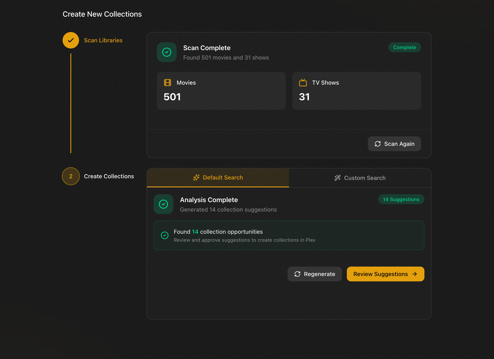
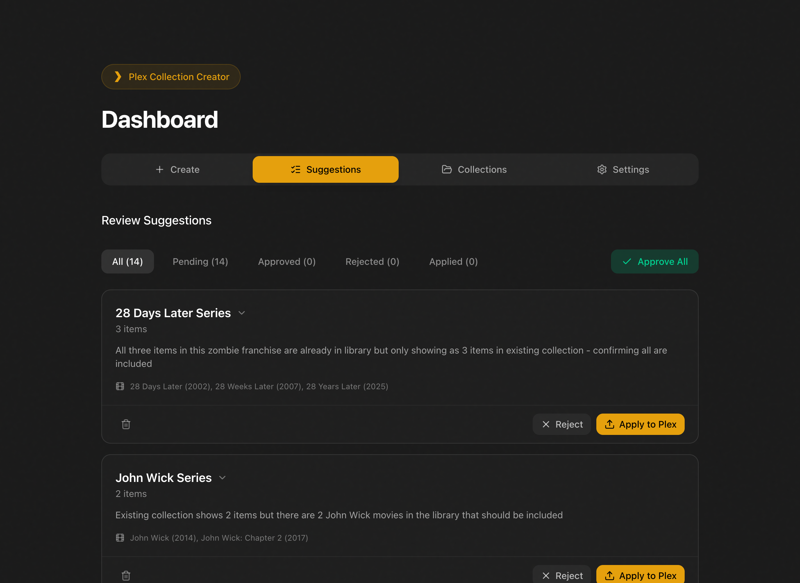
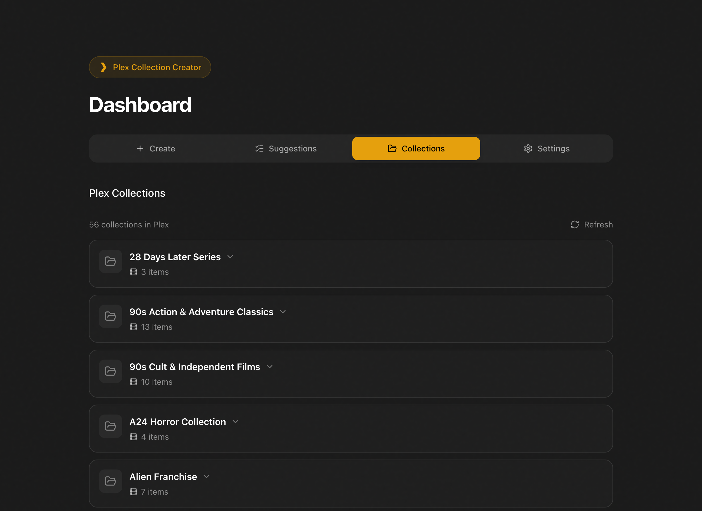

# Plex Collection Creator

**Automatically organize your Plex library with AI-powered collections.**




Stop manually creating collections. Let AI analyze your library and suggest franchises, series, and thematic groupings — then apply them to Plex with one click.

---

## What It Does

- **Finds franchises automatically** — Star Wars, Marvel, Harry Potter, etc.
- **Discovers thematic collections** — "Mind-Bending Thrillers", "90s Classics", "Award Winners"
- **Custom searches** — Ask for anything: "Find all Christmas movies" or "Movies with twist endings"
- **One-click apply** — Review suggestions and create collections directly in Plex

---

## What You Need

| Requirement | Details |
|-------------|---------|
| **Docker Desktop** | [Download here](https://www.docker.com/products/docker-desktop/) — free for personal use |
| **Plex Media Server** | Running on your network |
| **AI API Key** | From Anthropic, OpenAI, AWS Bedrock, or Google Vertex AI |

> **Which AI provider?** For the easiest setup, we recommend [Anthropic](https://console.anthropic.com) or [OpenAI](https://platform.openai.com). Both offer pay-as-you-go pricing with no minimum.

---

## Quick Start

### 1. Start the App

Open a terminal and run:

```bash
git clone https://github.com/schuettc/plex-collection-creator.git
cd plex-collection-creator
docker compose up -d
```

### 2. Open Your Browser

Go to **[http://localhost:32500](http://localhost:32500)**



---

## Setup Guide

The setup wizard walks you through three steps:

### Step 1: Connect to Plex

Click **Connect with Plex** and sign in with your Plex account. The app will find your server automatically.



### Step 2: Choose Your Libraries

Select which movie and TV libraries you want to analyze.

### Step 3: Add Your AI Key

Enter your API key from your chosen AI provider.



---

## Creating Collections

Once setup is complete, you'll see the Dashboard:



### 1. Scan Your Library

Click **Start Scan** to fetch your media metadata from Plex.



### 2. Run AI Analysis

Click **Analyze** and let the AI find collection opportunities.



### 3. Review Suggestions

Browse the AI's suggestions. Each shows the movies/shows that would be included.


You can filter by type or search for specific collections:



### 4. Apply to Plex

Click **Approve** on any suggestion to create it in Plex. Or **Reject** to dismiss it.



---

## Custom Searches

Want something specific? Use **Custom Search** to ask for anything:

- "Find all movies directed by Christopher Nolan"
- "Create a collection of 80s action movies"
- "Group movies with surprise endings"
- "Find all holiday and Christmas movies"

---

## Getting an AI API Key

| Provider | How to Get a Key |
|----------|------------------|
| **Anthropic** | Sign up at [console.anthropic.com](https://console.anthropic.com), add a payment method, create an API key |
| **OpenAI** | Sign up at [platform.openai.com](https://platform.openai.com), add a payment method, create an API key |
| **AWS Bedrock** | Requires AWS account with Bedrock model access enabled |
| **Google Vertex AI** | Requires GCP project with Vertex AI API enabled |

**Cost:** Analyzing a typical library (500-1000 movies) costs roughly $0.10-0.50 depending on provider.

---

## FAQ

**Q: Does this modify my actual media files?**
No. It only creates collections in Plex's database. Your files are never touched.

**Q: Can I undo a collection?**
Yes. Collections can be deleted from Plex at any time.

**Q: Does it work with TV shows?**
Yes! It finds series, spinoffs, and shared-universe shows.

**Q: My Plex server isn't found. What do I do?**
Make sure your Plex server is on the same network. Try using the server's IP address directly.

**Q: How do I stop the app?**
Run `docker compose down` in the terminal. Your data is preserved.

**Q: How do I completely reset?**
Run `docker compose down -v` to remove all data and start fresh.

---

## License

MIT
